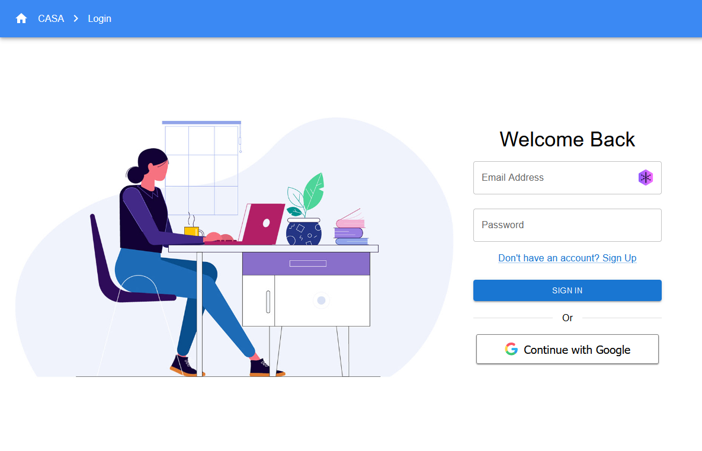
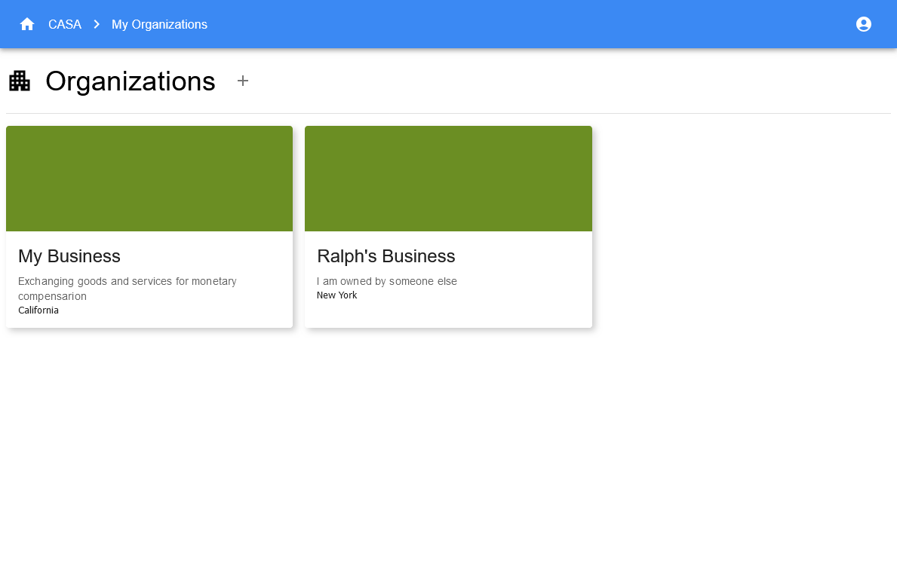
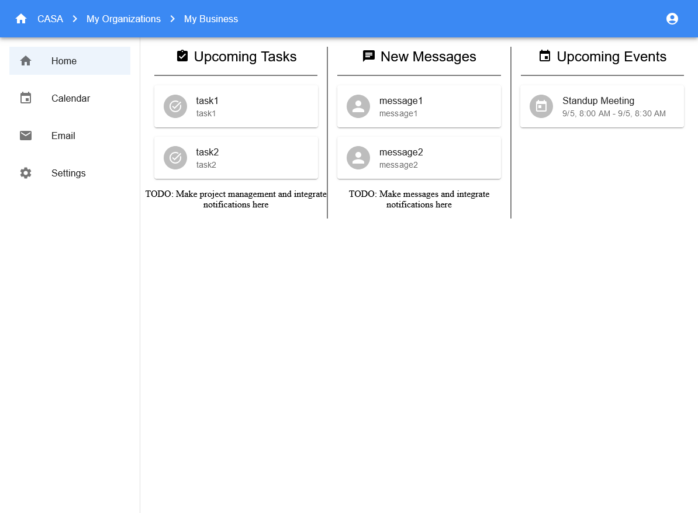
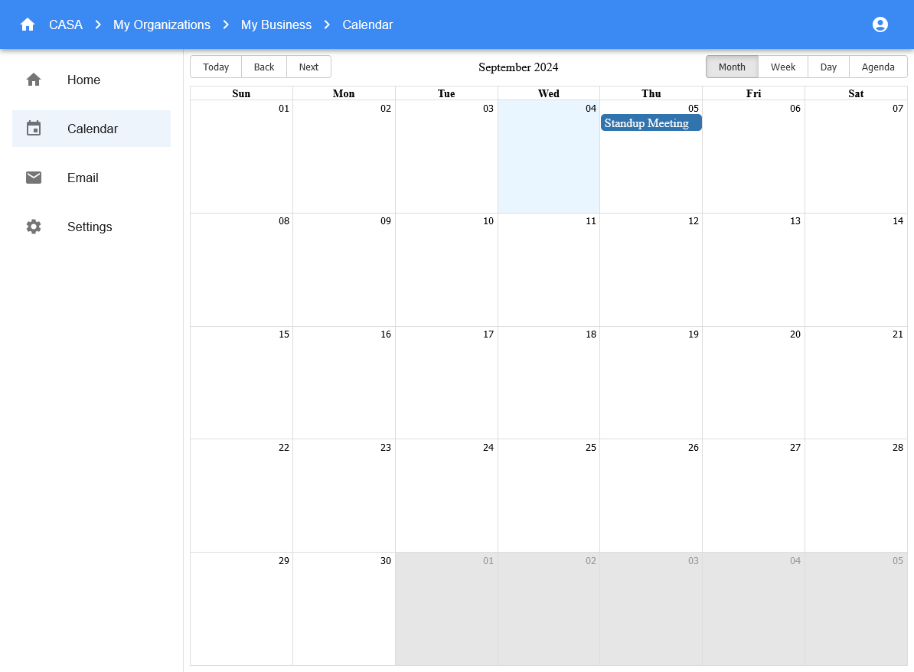
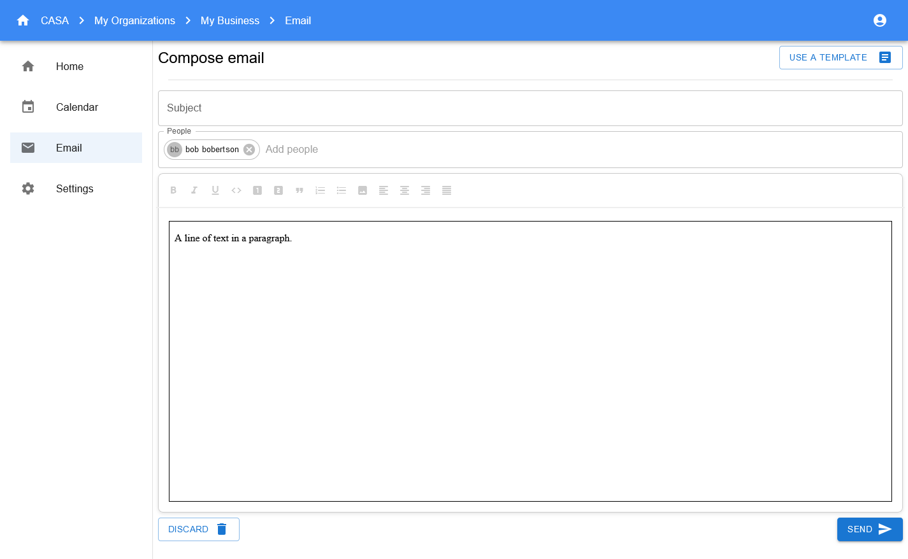
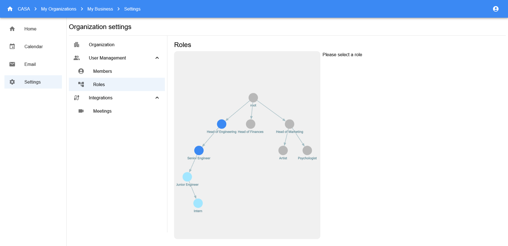

[![Contributors][contributors-shield]][contributors-url]
[![Forks][forks-shield]][forks-url]
[![Stargazers][stars-shield]][stars-url]
[![Issues][issues-shield]][issues-url]
[![MIT License][license-shield]][license-url]

 

 

  <!--  -->

  <h3 align="center">CASA Business Manager</h3>

  

    An all-in-one business management webapp template
     
     
	<!-- todo: link this to the demo once it is up -->
    <a href="https://github.com/casa-business-manager/CASA">View Demo</a>
    ·
    <a href="https://github.com/casa-business-manager/CASA/issues/new/choose">Report Bug</a>
    ·
    <a href="https://github.com/casa-business-manager/CASA/discussions/new?category=ideas">Request Feature</a>
  

<!-- TABLE OF CONTENTS -->

  
Table of Contents

  <ol>
    <li>
      <a href="#about-the-project">About The Project</a>
      <ul>
        <li><a href="#built-with">Built With</a></li>
      </ul>
    </li>
    <li><a href="#screenshots">Screenshots</a></li>
    <li>
      <a href="#getting-started">Getting Started</a>
      <ul>
        <li><a href="#prerequisites">Prerequisites</a></li>
        <li><a href="#installation">Installation</a></li>
      </ul>
    </li>
    <li><a href="#acknowledgments">Acknowledgments</a></li>
  </ol>

<!-- ABOUT THE PROJECT -->
## ⚠️ Maintenance Warning ⚠️
This project is incomplete and the authors are not currently planning to continue working on it in the future.

The repository will remain public for the forseeable future but any issues and pull requests may not be addressed in a timely manner, if at all.

## About The Project

CASA was built to be an all-in-one business management webapp with extra flexibility for businesses to customize it to their needs. We wanted to pack all the important business management tools (Human Resources, Project Management, Inventory, etc...) into one tightly integrated webapp to simplify the management process and provide all the resources in one place.

Admittedly, we fell short of our goals.

However, we hope that this project can serve as a solid starting point for any future projects whose implementation follows a similar pattern to ours since we have already made significant progress in both frontend and backend development towards several major features, such as:

* Account sign up and login
* Organization creation and joining
* Notifications
* Interactive calendar
* Email sending with a rich text editor and template selection
* Customizable hierarchical roles system

<!-- todo: link to the demo -->
For more information about the state of the project, check out the demo or <a href="#screenshots">Screenshots</a> sections

(<a href="#readme-top">back to top</a>)

### Built With

* [![React][React.js]][React-url]
* [![Spring Boot][SpringBoot]][SpringBoot-url]
* [![MariaDB][MariaDB]][MariaDB-url]

(<a href="#readme-top">back to top</a>)

<!-- SCREENSHOTS -->
## Screenshots

	
	
	
	
	
	

(<a href="#readme-top">back to top</a>)

<!-- GETTING STARTED -->
## Getting Started

If you would like to get a local copy of this project up and running, we recommend running it in our developer container. There are many benefits to developing in a container. We all have the same environment, it saves you from installing and configuring a ton of new software directly on your local machine, and there are some nice features like colored/formatted terminals.

### Prerequisites

If you are on Windows, you should have [WSL](https://learn.microsoft.com/en-us/windows/wsl/install#install-wsl-command) installed before continuing with Docker. Also make sure you have git and an SSH key linked to your GitHub account installed in WSL if you want to contribute or make edits. If you are not on Windows, you can ignore this.

Install [Docker](https://www.docker.com/products/docker-desktop/) and [Visual Studio Code](https://code.visualstudio.com/download). This process may differ depending on your operating system. 

Finally, install the [Dev Container](https://marketplace.visualstudio.com/items?itemName=ms-vscode-remote.remote-containers) extension on VS Code. 

### Installation

1. Ensure Docker is running. and open the repository using Visual Studio Code.
3. Within VS Code, press F1 and select **Dev Containers: Clone Repository in Container Volume**, and it should bring up an option to select a repository to clone. Either paste in the repository URL `https://github.com/casa-business-manager/CASA.git` or select an option through GitHub (you may need to sign in through GitHub).
	* This will reopen your VS Code to the cloned repository inside the container.
	* The first time might take longer to load because it has to download and cache things.
3. Install the **Recommended Extensions** that pops up at the bottom right, or find them in the extensions tab by searching `@recommended`. 
	* If you are unable to install these, you can still run the project using the command line via `make start` in either the `/`, `/frontend`, or `/backend` directories, as well as `make format` in the `/frontend` directory
4. Done! The dev container should be fully configured and packages fully installed. 
	* This container can be reopened when you reopen VS Code (Docker must be running). You can also go to `File > Open Recent > .../CASA [Dev Container]`. 
	* If you ever have to recreate your dev container, you'll have to repeat these steps. 
	* The devcontainer will only run `npm install` once when it is created so you won't have to start another download, but this might fail or the dependencies might change after the container's initial creation. After the devcontainer's initial creation you will have to rerun `npm install` and handle your own frontend packages as needed.

### Setup FAQ
- "My VS Code says that the JDK was not found and the path it tries is on my local machine - not my container!"
	1. Open your VS Code `settings.json` file (not the one in `/.vscode`)
	2. Comment out the line with key `"java.home"`
	3. Restart your devcontainer

- "I'm getting a permission issue with GitHub after selecting an account"
	1. When the menu pops up and you have to select an account, select "sign in with a new account"
	2. If prompted, just enter in your existing account.
	3. If they ask again, repeat this process.

### Helpful commands
The developer container is also equiped with helpful shortcuts. They will be documented here as they are made:

1. `kill3000` - kills processes with port 3000 (execute frontend in case you lose the terminal but it is still running).
2. `kill8080` - kills processes with port 8080 (execute backend in case you lose the terminal but it is still running).
3. `resetDB` - DROPs (deletes) the entire database, then creates a fresh one. May show an error if there is no database to DROP.
4. `mvnStart` - command line shortcut to start the backend without needing the extension (must run from backend/ directory).
5. `make` - command line shortcuts to start the project without requiring any extensions. These can also work to start the project locally, provided the dependencies are all installed and correctly configured.
	* `make start`:
		* when run from the root (`/`) directory, it will start the frontend and backend in parallel
		* when run from the frontend (`/frontend`) directory, it will start the frontend via `npm start`
		* when run from the backend (`/backend`) directory, it will start the backend via `mvn spring-boot:run`
	* `make format`: can only be run from `/frontend`. Formats the frontend code using Prettier.
	* `make reset`: resets the database to an initial state
	* check the Makefiles for more options as they may be updated.

(<a href="#readme-top">back to top</a>)

### Top contributors:

(<a href="#readme-top">back to top</a>)

<!-- ACKNOWLEDGMENTS -->
## Acknowledgments

The authors of this repository would like to thank:

* [Best-README-Template](https://github.com/othneildrew/Best-README-Template)
* [Material-UI/MUI](https://mui.com/)
* [React-Big-Calendar](https://github.com/jquense/react-big-calendar)
* [Reagraph](https://github.com/reaviz/reagraph)
* [Slate](https://github.com/ianstormtaylor/slate)

(<a href="#readme-top">back to top</a>)

<!-- LINKS -->
<!-- SHIELD -->
[contributors-shield]: https://img.shields.io/github/contributors/casa-business-manager/CASA.svg?style=for-the-badge
[contributors-url]: https://github.com/casa-business-manager/CASA/graphs/contributors
[forks-shield]: https://img.shields.io/github/forks/casa-business-manager/CASA.svg?style=for-the-badge
[forks-url]: https://github.com/casa-business-manager/CASA/network/members
[stars-shield]: https://img.shields.io/github/stars/casa-business-manager/CASA.svg?style=for-the-badge
[stars-url]: https://github.com/casa-business-manager/CASA/stargazers
[issues-shield]: https://img.shields.io/github/issues/casa-business-manager/CASA.svg?style=for-the-badge
[issues-url]: https://github.com/casa-business-manager/CASA/issues
[license-shield]: https://img.shields.io/github/license/casa-business-manager/CASA.svg?style=for-the-badge
[license-url]: https://github.com/casa-business-manager/CASA/blob/master/LICENSE.txt

<!-- todo: upload a screenshot -->
[casa-screenshot]: screenshots/organization_selection.png

<!-- BUILT WITH -->
[React.js]: https://img.shields.io/badge/React-20232A?style=for-the-badge&logo=react&logoColor=61DAFB
[React-url]: https://reactjs.org/
[SpringBoot]: https://img.shields.io/badge/SpringBoot-6DB33F?style=for-the-badge&logo=SpringBoot&logoColor=white
[SpringBoot-url]: https://spring.io/projects/spring-boot
[MariaDB]: https://img.shields.io/badge/MariaDB-003545?style=for-the-badge&logo=mariadb&logoColor=white
[MariaDB-url]: https://mariadb.org/